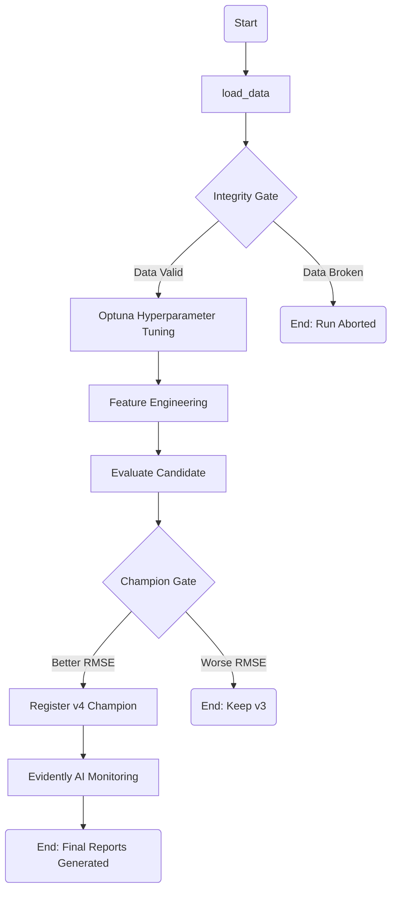

Technical Summary of Flow: NYC Taxi Tip Monitoring
## 1. Pipeline Architecture (DAG)
The following Directed Acyclic Graph (DAG) represents the automated decision-making process within the Metaflow orchestration. It highlights the "gates" that protect the production environment from poor data or inferior models.

## 2. Shared Logic: green_taxi_drift_lib.py
To ensure consistency and prevent training-serving skew, all critical data logic is centralized in this library.

load_taxi_table(): Handles Parquet ingestion and initial cleaning.

run_integrity_checks(): Acts as the "Integrity Gate" by validating schema and data quality.

process_features(): Transforms raw data into model-ready features, ensuring the same math is used for both training and monitoring.

## 3. Model Optimization & Evolution
XGBoost vs. Decision Tree: The project evolved from a baseline Decision Tree (Version 1) to an ensemble XGBoost (Versions 2-4) to better handle complex tip patterns.

Automated Tuning (Optuna): Instead of manual tuning, Optuna was used to systematically explore the hyperparameter space (learning rate, depth, etc.) to minimize RMSE.

The Champion Gate: In 03_xgboost_optimized_champion.py, the system compares the new candidate's RMSE against the current registered @champion. A new version is only registered if it proves superior.

## 4. Production Monitoring (Evidently AI)
The monitoring flow (04_taxi_flow_monitoring.py) performs two key analyses using the August data batch:

Data Drift: Compares feature distributions between the January reference and August batch.

Performance Estimation: Uses Probabilistic Error Forecasting to predict the model's performance on unlabelled data.

## 5. Resilience & Metaflow Features
Resume Capability: Utilizing Metaflow’s checkpointing, failed runs can be resumed using the resume command, picking up from the last successful step.

Artifact Logging: All monitoring HTML reports are logged as MLflow Artifacts, providing a central "Source of Truth" for every run.